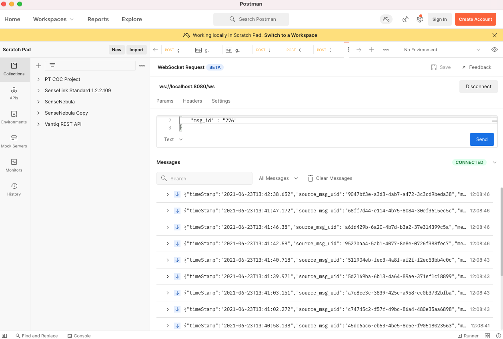

# Nebula Simulator

The objective of this project is to create a Mock Server to simulate responses from SenseTime Nebula Simulator.
It is intended to work with *SenseNebulaConnector* Extension Source.

This Mock Server provides the following REST Endpoints to support how *SenseNebulaConnector* is expected to work:
- /api/json
    - msg_id: 257
    - msg_id: 1028
    - msg_id: 1051
    - msg_id: 1281
    - msg_id: 1301
    - msg_id: 1286

There is also a WebSocket endpoint at:
- ws://host:port/ws

This websocket endpoint will accept two types of messages with the following payload:
- msg_id: 776 -- This will start the replay of events from input file and send it through the websocket connection
- msg_id: 9999 -- This will stop the replay of events

## Getting Started ##

Download the input file containing the JSON Array from here:
https://drive.google.com/file/d/1bwIphEVOPg0xVnek6zwZimI5-6NA3QHB/view?usp=sharing

To run the project:

`./gradlew bootRun --args='--input.file="/fullpath/to/recombinedMsg.json" --output.batchSize=4 --output.wait=2 --output.maxSize=20'`

where:
* `input.file`: contains the full path to the input JSON Array file for replaying events
* `output.batchsize`: # of records to send in a batch
* `output.wait`: # of seconds to wait between batch
* `output.maxSize`: max # of total records to send (if value is -1 then no limits)

## Connecting to Mock Server ##
The intention is to connect the *SenseNebulaConnector* extension source to the Mock Server.

However, it is possible to independently test the Mock Server by connecting to it with any REST and/or WebSocket Client.

For example, Postman can be used to connect as a Web Socket client.

